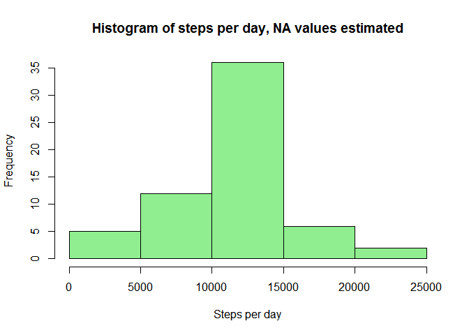

## Loading and preprocessing the data
Load data from the compressed file.


```r
zipfile <- "activity.zip"
zipdir <- unzip(zipfile,list=TRUE)
amdata <- read.csv(unz(zipfile,zipdir$Name[1]))
summary(amdata)
```

```
##      steps            date              interval     
##  Min.   :  0.00   Length:17568       Min.   :   0.0  
##  1st Qu.:  0.00   Class :character   1st Qu.: 588.8  
##  Median :  0.00   Mode  :character   Median :1177.5  
##  Mean   : 37.38                      Mean   :1177.5  
##  3rd Qu.: 12.00                      3rd Qu.:1766.2  
##  Max.   :806.00                      Max.   :2355.0  
##  NA's   :2304
```


## What is mean total number of steps taken per day?

Summarize steps by day

```r
all_dates <- unique(amdata$date)
stepsbd_all <- sapply(all_dates,
                      function(d) sum(amdata$steps[amdata$date == d],
                                      na.rm=TRUE))

## Originally used all_dates to summarize, but there are 8 dates for which 
## there is no data. data_dates excludes dates with no data.

data_dates <- unique(amdata$date[complete.cases(amdata)])
stepsbd_dd <- sapply(data_dates,
                     function(d) sum(amdata$steps[amdata$date == d],
                                     na.rm=TRUE))
```

1. Histogram of steps per day, excluding dates with no data

```r
hist(stepsbd_dd, col="lightblue", xlab="Steps per day",
     main="Histogram of steps per day")
```

<!-- -->

2. Mean and median steps per day, excluding dates with no data

```r
mean_spd <- as.integer(mean(stepsbd_dd))
med_spd <- median(stepsbd_dd)
```

The mean steps per day is 10766. The median steps per day is 10765.


## What is the average daily activity pattern?

Summarize steps by interval

```r
intervals <- unique(amdata$interval)
stepsbi <- sapply(intervals,
                  function(i) mean(amdata$steps[amdata$interval == i],
                                   na.rm=TRUE))
```

1. Time series plot of average steps per 5-minute interval across all dates.


```r
## convert "hhmm" intervals to minutes
xminutes <- (intervals %/% 100) * 60 + intervals %% 100

## set up x-axis ticks and labels
xaxisTicks <- c(0, 6*60, 12*60, 18*60, 24*60)
xaxisLabels <- c("12am", "6am", "12pm", "6pm", "12am")

## ts_plot function draws time series plot with custom axes
ts_plot <- function (x, y, title, ymax=NA) {
    if (is.na(ymax)) {
        plot(x, y, type="l", axes=FALSE,
             xlab = "Time of Day", ylab = "Steps per 5-minute interval",
             main = title)    
    } else {
        plot(c(min(x),max(x)), c(min(y),ymax), type="n", axes=FALSE,
             xlab = "Time of Day", ylab = "Steps per 5-minute interval",
             main = title)
        lines(x,y)
    }
    axis(1, at=xaxisTicks, labels=xaxisLabels)
    axis(2)
    box()
}

## create plot
plot_title <- "Daily Activity Pattern - average steps per 5-minute interval"
ts_plot(xminutes, stepsbi, plot_title)
```

<!-- -->

2. Which 5-minute interval, on average across all the days in the dataset, contains the maximum number of steps?

```r
int_maxsbi <- intervals[stepsbi==max(stepsbi)]
```
The interval with the maximum average steps is 835.


## Imputing missing values

1. Calculate and report the total number of missing values in the dataset (i.e. the total number of rows with `NA`s)

```r
missing_vals <- sum(is.na(amdata$steps))
total_vals <- length(amdata$steps)
```

There are 2304 missing values in the dataset (out of 17568).

2. Use the mean for the 5-minute interval to replace missing values.

```r
## create data.frame to look up mean by interval
mean_steps <- data.frame(row.names=intervals, steps=stepsbi)
```


3. Create a new dataset that is equal to the original dataset but with the missing data filled in.

```r
## copy original data.frame
est_amdata <- amdata

## select NA rows
na_steps <- is.na(est_amdata$steps)

## select NA intervals (convert to character for lookup)
na_intervals <- as.character(est_amdata$interval[na_steps])

## replace NA values
est_amdata$steps[na_steps] <- sapply(na_intervals,
                                     function(i) mean_steps[i,"steps"])

## count NA values after replacement (should be zero if done correctly)
sum(is.na(est_amdata$steps))
```

```
## [1] 0
```


4. Make a histogram of the total number of steps taken each day and Calculate and report the **mean** and **median** total number of steps taken per day. Do these values differ from the estimates from the first part of the assignment? What is the impact of imputing missing data on the estimates of the total daily number of steps?

```r
## summarize steps by day for updated dataset
est_stepsbd <- with(est_amdata, {
    sapply(unique(date), function(d) sum(steps[date == d], na.rm=TRUE))
})

## plot histogram
hist(est_stepsbd, col="lightgreen", xlab="Steps per day",
     main="Histogram of steps per day, NA values estimated")
```

<!-- -->

```r
## compute mean and median
mean_est_spd <- as.integer(mean(est_stepsbd))
med_est_spd <- as.integer(median(est_stepsbd))
```

The mean steps per day is 10766. The median steps per day is 10766. The mean and median are similar to the mean and median of the original data set if dates without data are excluded.

## Are there differences in activity patterns between weekdays and weekends?

1. Create a new factor variable in the dataset with two levels -- "weekday" and "weekend" indicating whether a given date is a weekday or weekend day.

```r
## set up day name to weekday/weekend map
weekday_map <- data.frame(row.names = weekdays(as.POSIXct.Date(5:11)),
                          type=c(rep("weekday",5), rep("weekend",2)))

## define function to return dtype (weekday/weekend factor) from date
get_dtype <- function(date) {
    weekday_map[weekdays(as.Date(date)),"type"]
}

## add new factor to data set
est_amdata["dtype"] <- factor(sapply(est_amdata$date,get_dtype))

head(est_amdata[est_amdata$interval==0,])
```

```
##          steps       date interval   dtype
## 1     1.716981 2012-10-01        0 weekday
## 289   0.000000 2012-10-02        0 weekday
## 577   0.000000 2012-10-03        0 weekday
## 865  47.000000 2012-10-04        0 weekday
## 1153  0.000000 2012-10-05        0 weekday
## 1441  0.000000 2012-10-06        0 weekend
```


2. Make a panel plot containing a time series plot (i.e. `type = "l"`) of the 5-minute interval (x-axis) and the average number of steps taken, averaged across all weekday days or weekend days (y-axis).

```r
## create ww_stepsbi data.frame for plot data
ww_stepsbi <- data.frame(interval=intervals, xval=xminutes)

## split est_amdata by weekday/weekend factor
ww_split <- split(est_amdata, est_amdata$dtype)

## compute mean for each interval according to w/w split
for (w in names(ww_split)) {
    ww_stepsbi[w] <- sapply(split(ww_split[[w]],ww_split[[w]]$interval),
                            function(df) mean(df$steps))
}
## set up panels
par(mfrow=c(2,1), mar = c(3,4,2,1), oma = c(0,0,0,0))

## plot
with(ww_stepsbi, {
    ts_plot(xval,weekday,"Weekday Activity",ymax=max(c(weekday,weekend)))
    ts_plot(xval,weekend,"Weekend Activity",ymax=max(c(weekday,weekend)))
})
```

<!-- -->
